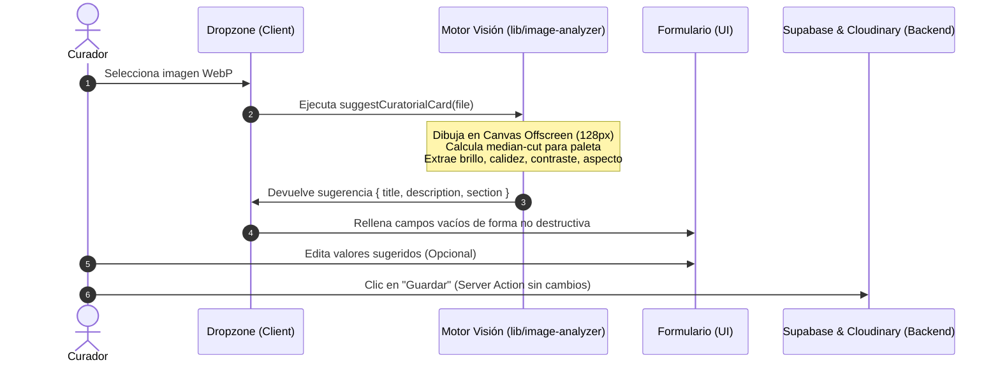

# Documento Técnico: Curaduría Asistida por Visión

Este documento detalla la implementación y decisiones de diseño detrás de la funcionalidad de **Curaduría Asistida por Visión** para la propuesta automática de fichas de arte (título, descripción y sección sugerida).

---

## 1. Ficha de la Funcionalidad

### Nombre de la funcionalidad
**Curaduría asistida por visión** — Ficha automática (título + descripción + sección sugerida) generada localmente en el navegador a partir del análisis visual de la imagen.

### Objetivo
Proponer automáticamente un título descriptivo, una descripción con tono museográfico y una sección temática probable al subir o reemplazar el WebP de un cuadro en el panel de administración. Todo el proceso se ejecuta de manera local e instantánea, con costo de infraestructura de **$0 USD** y sin añadir peso o complejidad al build y despliegue del servidor en Vercel.

### Problema que resuelve
* **Bloqueo de la página en blanco:** Reduce la fricción cognitiva del curador/administrador al escribir descripciones para más de 21 piezas desde cero.
* **Museo "mudo":** Resuelve la falta de descripciones que ocurría cuando las obras se dejaban vacías en el formulario, enriqueciendo el museo virtual 3D.
* **Limitaciones de Vercel (Bundle Size / Serverless Timeout):** Evita el uso de modelos de lenguaje visual (VLM) o frameworks neuronales pesados (como ONNX/WASM locales) que disparan el tamaño de los builds y el tiempo de respuesta.

### Descripción técnica
El flujo completo se ejecuta de forma síncrona en el navegador del curador:

1. **Lectura y Reducción Visual:** La imagen seleccionada se procesa en un `<canvas>` oculto a baja resolución (~128px). Esto es ultrarrápido y consume una cantidad insignificante de memoria.
2. **Extracción de Firma Visual:** Mediante un algoritmo de cuantización clásica **Median-Cut** implementado en JavaScript/TypeScript puro, se extraen los colores dominantes y se contrastan contra un diccionario de color artístico en español de más de 30 tonalidades (ej. *ocre, terracota, siena natural, azul cobalto*).
3. **Métricas Estructurales:** Se calculan la luminancia promedio (brillo), la desviación estándar (contraste), la saturación en HSL, la calidez (balance de rojos/azules) y la relación de aspecto de la imagen.
4. **Clasificación por Reglas (No Neural):** Con las firmas visuales, un motor de reglas heurísticas clasifica la obra en tipos de arte (ej. *paisaje, retrato, escena festiva, escultura, textil*) y deduce la sección museográfica correspondiente (*Lugares, Fiestas, Comidas, Historia, Independencia*).
5. **Generación de Lenguaje Natural (NLG):** Se ensambla un bloque narrativo estructurado y elegante en español nativo utilizando plantillas paramétricas basadas en los atributos calculados.

### Tecnologías utilizadas
* **Canvas API & ImageData:** Para procesamiento local de píxeles y cuantización sin dependencias externas.
* **TypeScript (TS Puro):** Para la lógica de clasificación determinista, ordenamiento por mediana e interpolación de plantillas.
* **React & Next.js:** Hooks de estado, refs de control y Server Actions para guardar la información persistida en Supabase y Cloudinary.

### Capturas de pantalla (Estructura de la Interfaz)
La interfaz del modal de edición incorpora de forma premium los siguientes elementos dinámicos:
* **Overlay "Analizando imagen..."**: Aparece sobre la vista previa de la imagen durante los breves milisegundos que toma procesar el Canvas.
* **Indicador "Ficha sugerida"**: Un badge dorado que confirma que la IA local ha sugerido el contenido.
* **Chips Informativos**: Un chip dinámico que muestra: `Sección sugerida: Fiestas` con un icono brillante.
* **Controles "Usar sugerencia"**: Botones contextuales pequeños que permiten al usuario restaurar o forzar la aplicación de la sugerencia en los campos de Título o Descripción.

### Posible integración con el proyecto principal
La integración es transparente y limpia:
* El módulo de análisis visual vive de manera aislada en `lib/image-analyzer.ts`.
* El formulario y el modal de edición interactúan con él puramente en el cliente.
* La persistencia en Supabase mediante `upsertCuadroAction` permanece inalterada, lo que asegura que el backend no requiera cambios ni adaptaciones.

---

## 2. Preguntas de Autoevaluación y Desarrollo

### ¿Cuál fue la necesidad identificada?
El museo contaba con un entorno 3D interactivo fantástico, pero muchas obras permanecían vacías o "mudas" para el usuario final debido a que el proceso de redactar descripciones históricas y curatoriales manualmente para decenas de piezas resulta tedioso y propicia el abandono del formulario.

### ¿Por qué decidió desarrollar esa funcionalidad?
Se optó por este enfoque local porque cumple con la premisa de **$0 costo** operativo y **cero lastre** de despliegue en Vercel. Resolver el problema mediante llamadas a APIs externas (como GPT-4 Vision) añade costos recurrentes y latencia de red, mientras que incorporar modelos neuronales pesados en el frontend rompe los límites de empaquetado del proyecto. Esta solución clásica de visión artificial es ligera, instantánea y robusta.

### ¿Qué tecnologías utilizó?
Canvas API, TypeScript para el motor de visión y el módulo NLG, y React (`useRef`, `useMemo`, `useState`) para la manipulación dinámica y no destructiva de los campos del formulario.

### ¿Qué dificultades encontró?
1. **Evitar la sobreescritura destructiva:** Si el curador ya ha escrito parte de un texto o título, la propuesta automática no debe pisar sus cambios a menos que el usuario lo solicite expresamente.
2. **Alertas de rendimiento en efectos:** React marcaba advertencias de lint (`react-hooks/set-state-in-effect`) debido a la inicialización y limpieza de los Object URLs de previsualización dentro de efectos que forzaban renderizados en cascada.

### ¿Cómo las resolvió?
1. **Flujo de sugerencias inteligente:** El auto-relleno solo actúa sobre campos cuyo valor sea estrictamente vacío al momento del análisis. Adicionalmente, se agregaron botones de acción rápida `✨ Usar sugerencia` junto a las etiquetas de los inputs para dar al curador el control absoluto sobre cuándo sobrescribir cada campo.
2. **Refactorización de URL con Refs:** Se reemplazó el estado del Object URL por un control basado en una referencia mutable (`objectUrlRef`) y derivación mediante `useMemo` con una función limpia de revocación, eliminando llamadas recursivas e innecesarias a `setState`.

### ¿Cómo se integraría al proyecto del equipo?
Se integra como un utilitario client-side en `lib/`. Cualquier miembro del equipo puede importar `suggestCuratorialCard` en otros formularios o vistas de carga sin preocuparse por configuraciones de base de datos, variables de entorno adicionales o dependencias pesadas en `package.json`.

### ¿Qué beneficios aportaría?
* **Ahorro de tiempo masivo:** Permite documentar una galería completa de cuadros en minutos en lugar de horas.
* **Consistencia museográfica:** Los textos generados siguen una estructura formal homogénea que mejora la calidad editorial percibida por el público.
* **Integración inmediata con el museo:** La descripción generada alimenta directamente la tarjeta informativa del canvas 3D y el narrador por voz (TTS), sin alterar el código de visualización.

### ¿Qué mejoras implementaría en una siguiente versión?
1. **Actualización Zero-Shot mediante CDN**: En una fase posterior, se podría cargar de forma diferida (lazy load) un modelo CLIP ultraligero a través de un CDN (como Hugging Face o ONNX Runtime Web) solo cuando el navegador esté ocioso (`requestIdleCallback`). Esto proporcionaría análisis semántico real de objetos sin impactar el bundle inicial de Vercel.
2. **Persistencia Directa de la Sección**: Modificar la base de datos para que la "sección temática" sea una columna editable y persistente que el modelo 3D del museo pueda usar para distribuir dinámicamente las obras en sus respectivas paredes de forma automática en lugar de depender de IDs de cuadro fijos.
